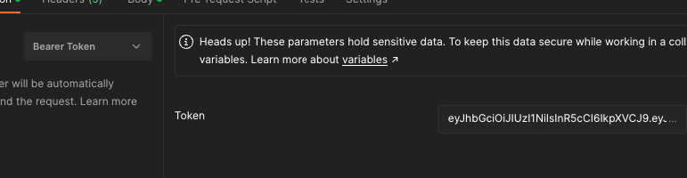

clonar o projeto. 

para baixar as dependencias
    mvn clean install

foi utilizado o H2
na variavel do properties caso em memoria o banco nao consiga ser criado coloca um caminho da sua maquina com permissão de escrita
spring.datasource.url= spring.datasource.url=jdbc:h2:file:C:SEU_CAMINHO

URL Swagger
http://localhost:8080/swagger-ui.html

URL H2
http://localhost:8080/h2-console

As rotas de exemplo está collection do postman estão na pasta resources do projeto
importar no postaman a collection > Collection.postman_collection.json

Primeiro cria um usuario PASTA usuario dentro do postman

Segundo chama o login com usuario e senha informado PASTA login dentro do postman

Adicionado o token como bearer token retornando nas requisições.

